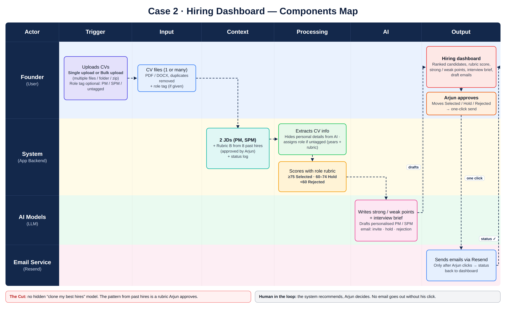

# Kargo Hiring Agent: Build Spec & Roadmap

**Case 2 · MESA AI and its Application · Founder's Office · Cohort C4**
**Owner:** Pulkit Nigam · **Version:** 1.0 · **Date:** 28 Sept 2026

> **For Claude Code:** this document is the single source of truth for the build. Read it fully before writing code. Sections 5–12 are the functional spec; Section 14 is the phased roadmap with acceptance criteria. Where this doc and your own defaults disagree, this doc wins. Anything marked **[LOCKED]** was agreed with the product owner and must not be changed without asking.

---

## Table of Contents

1. [Context: Kargo and Arjun](#1-context-kargo-and-arjun)
2. [Automation Brief: Pain, User, Outcome](#2-automation-brief-pain-user-outcome)
3. [User Journey: Today vs Tomorrow](#3-user-journey-today-vs-tomorrow)
4. [Nine Checks and The Cut](#4-nine-checks-and-the-cut)
5. [Components Map](#5-components-map)
6. [End-to-End Workflow](#6-end-to-end-workflow)
7. [Rubric: How It Was Built](#7-rubric-how-it-was-built)
8. [Rubric: Final Scoring Spec](#8-rubric-final-scoring-spec)
9. [Role Assignment Logic](#9-role-assignment-logic)
10. [Decision Bands, Hold Rule and Overrides](#10-decision-bands-hold-rule-and-overrides)
11. [Founder Dashboard Spec](#11-founder-dashboard-spec)
12. [Email Spec: Invite, Hold, Regret](#12-email-spec-invite-hold-regret)
13. [Data Model, AI Contracts and Guardrails](#13-data-model-ai-contracts-and-guardrails)
14. [Build Roadmap for Claude Code](#14-build-roadmap-for-claude-code)
15. [Testing and Validation](#15-testing-and-validation)
16. [Success Metrics](#16-success-metrics)
17. [Assumptions and Open Items](#17-assumptions-and-open-items)
18. [Appendix: Alternative Rubrics A and C](#18-appendix-alternative-rubrics-a-and-c)

---

## 1. Context: Kargo and Arjun

| | |
|---|---|
| **Company** | Kargo: Series A logistics SaaS, Mumbai. Automates shipment tracking, documentation and carrier coordination for mid-sized freight forwarders. |
| **Stage** | Series A closed early 2026. Scaling from 40 to 70 people by December. |
| **Founder** | Arjun Mehta. There is no HR function, so Arjun is the hiring manager for every role. |
| **Open roles** | Product Manager (PM) and Senior Product Manager (SPM). Both report to Arjun. There is no Head of Product. |
| **Status** | Open since July. 11 weeks in: **60 applications, 19 opened, 0 offers.** |
| **Cost of delay** | Engineering has no PM ownership. Sprint priorities drift, roadmap decisions get deferred, and investor targets start to slip. |

**Inputs Arjun has provided:**

| Folder | Contents |
|---|---|
| `applications/` | 60 CVs across PM and SPM, in mixed formats. Some are tagged with a role and some are not. The CVs are uploaded directly into the agent. |
| `hires/` | 8 past hire profiles: role, what stood out, interview notes, outcome and rating. |
| `jds/` | JDs for PM and SPM. |

**Past hires (calibration set):**

| Name | Role | Joined | Last rating |
|---|---|---|---|
| Rohan Desai | Head of Engineering | Jul 2022 | Exceeds |
| Sunita Krishnamurthy | Operations Lead | Jan 2023 | Exceeds |
| Vikram Nair | Product Manager | Jun 2023 | Meets |
| Aditya Shetty | Sales Lead | Aug 2023 | Exceeds |
| Preetham Rao | Backend Engineer | Feb 2024 | Below |
| Meghna Tiwari | Customer Success Manager | Aug 2024 | Exceeds |
| Lavanya Iyer | Product Manager | Apr 2025 | Exceeds |
| Rahul Bose | Growth & Marketing Lead | Jun 2025 | Meets |

---

## 2. Automation Brief: Pain, User, Outcome

### Pain
- **Every review starts from scratch.** Arjun reads CVs late at night in 45-minute gaps. He shortlists and passes on instinct.
- **No record of anything.** There are no notes, no criteria and no rationale he could hand to someone else. The decisions live only in his head.
- **The wrong yardstick.** He evaluates against the JD, but the JD describes the role. It doesn't predict who succeeds. His best hires shared traits the JD never asks for.
- **Nothing happens after a decision.** Two strong candidates got a "let's chat" reply in August, and neither conversation happened. 19 people had their application opened and never heard back. That's the reputation Kargo is building by accident.

### User
**Arjun Mehta, Founder.** He is time-poor, the only decision-maker, and reviews from his laptop or phone in short windows. He wants to **look, decide and move**, and never to chase, draft or remember to send.

### Outcome
- **Primary:** an offer to the right person for PM and SPM **before December**.
- **Secondary:**
  - A shortlist Arjun trusts, ranked against the pattern of his best hires as well as the JD.
  - Every candidate gets a score and a written reason.
  - **Every candidate hears back.**
  - Arjun's decision is the last thing he touches.

> **Principle [LOCKED]:** *The system recommends. Arjun decides. That decision is the last thing he touches.*

---

## 3. User Journey: Today vs Tomorrow

### Journey Today

| # | Step | What happens | Pain |
|---|---|---|---|
| 1 | CV arrives | It lands in an inbox or folder | No acknowledgement goes out |
| 2 | CV waits | Sits unopened for days or weeks | 41 of 60 never opened |
| 3 | Late-night review | Arjun opens a few in a 45-minute gap | Starts from scratch every time |
| 4 | Instinct call | Shortlists or passes on gut feel | No criteria, no notes |
| 5 | Reply (sometimes) | A "let's chat" reply goes out | No scheduling link, no follow-up |
| 6 | Nothing happens | The conversation is never booked | Strong candidates are lost |
| 7 | Silence | Rejected and unopened candidates hear nothing | Reputation damage |
| **Result** | | **11 weeks, 0 offers** | Runway burning |

### Journey Tomorrow

| # | Step | Actor | What happens |
|---|---|---|---|
| 1 | Upload | Founder | Bulk-uploads all CVs (files, folder or zip). A role tag is optional. |
| 2 | Prepare | System | Parses, removes duplicates, hides personal details, and assigns a role if untagged |
| 3 | Score | System + AI | Scores every CV on the role's rubric, quoting the CV line behind each score |
| 4 | Explain | AI | Writes strong points, weak points and interview probes. Drafts the email for each candidate. |
| 5 | Review | Founder | Opens the dashboard: a ranked list, the score on every row, a click-through side panel |
| 6 | Adjust | Founder | Moves candidates between Selected, Hold and Rejected if he disagrees, with a one-line reason |
| 7 | Send | Founder → Resend | Clicks **"Send to all selected"**, then one confirmation and a 10-minute undo window. Invites, hold notes and regrets go out. |
| 8 | Follow-through | System | Hold candidates are resolved within 7 days. The status is updated, and a nudge appears if anything is stuck. |
| **Result** | | | **Every candidate scored, every candidate hears back, interviews booked in days, not weeks** |

---

## 4. Nine Checks and The Cut

| # | Check | Evidence from the case | Verdict |
|---|---|---|---|
| 1 | **Is it repetitive?** | 60 CVs across 2 roles, and every review starts from scratch. More hiring is coming (40 → 70 people). | ✅ Pass |
| 2 | **Is there a clear trigger?** | CV upload (single or bulk). Arjun's click is the trigger for the emails. | ✅ Pass |
| 3 | **Are the inputs available?** | CVs, JDs and 8 hire profiles are provided. The CVs come in mixed formats, so they need parsing. | ⚠️ Pass, with prep |
| 4 | **Can the rules be written down?** | Today there are none. The rules have to be extracted from `hires/` into a rubric. That's the core of the build. | ⚠️ Must be created |
| 5 | **Is there ground truth?** | Past hires have ratings (5 Exceeds, 2 Meets, 1 Below). There is no data on who left. | ⚠️ Partial |
| 6 | **Is the sample big enough to trust?** | 8 hires, only 2 PMs, and no SPM ever hired | ❌ Fails for an automated black-box scorer |
| 7 | **Where must a human decide?** | "The system recommends. Arjun decides." | ✅ Clear line |
| 8 | **How costly is a mistake?** | Wrongly rejecting a strong candidate can't be undone and nobody sees it. A careless email damages the brand. | ⚠️ High, so everything must be explainable and reviewable |
| 9 | **Fairness, privacy, and is it worth it?** | Personal data and a risk of cloning Arjun's biases, weighed against 11 lost weeks and burning runway | ⚠️ Worth building, with guardrails |

### The Cut [LOCKED]

**What Arjun described wanting:** *"A list of people who look like his best hires."* That means an automated scorer that clones the pattern of his history.

**What stops it:** checks 5, 6 and 9 together.

- **Too little data:** 8 hires across 7 different roles, with only 2 PMs and no SPMs.
- **Missing outcome data:** there is no data on who stayed or left.
- **Bias:** "people like my past hires" copies whatever biases shaped those hires.

**What we build instead:**

- The pattern is extracted into a **transparent, named rubric that Arjun approves**.
- Every score cites evidence from the CV.
- No candidate is filtered out unseen.
- **No email is sent without Arjun's click.**

---

## 5. Components Map



**Actors:** Founder (Arjun) · System (app backend) · AI Models (LLM) · Email Service (Resend)

| Stage | Actor | Component | Details |
|---|---|---|---|
| **Trigger** | Founder | CV upload | **Single upload or bulk upload** (multiple files, folder or zip). The role tag is optional: PM, SPM or untagged. |
| **Input** | System | CV files (1 or many) | PDF and DOCX are converted to text. Duplicates are removed by file hash plus email. Unreadable files go to **"Needs manual look"** and are never silently dropped. |
| **Context** | System | Reference data | The 2 JDs (PM, SPM), **Rubric B** (built from the 8 past hires and approved by Arjun, with versions tracked), the status log (who has been contacted), email templates and the Cal.com link |
| **Processing** | System | Prepare and guard | Standard profile extraction, **personal details hidden before scoring** (name, photo, age, gender, college, family), role assignment when untagged, score bands, routing by decision, a duplicate-email check |
| **AI** | AI Models | Think and write | Scores each criterion from 0 to 4 **with a CV quote**, writes strong and weak points, writes 2–3 interview probes, and drafts a personalised PM or SPM email (invite, hold or regret) |
| **Output** | Founder | Hiring dashboard | Ranked candidates, a rubric score on every row, strong and weak points in the side panel, the interview brief and draft emails |
| **Output** | Founder | Approval | Arjun moves candidates between Selected, Hold and Rejected, then does a **one-click send** |
| **Output** | Email Service | Delivery | Resend sends **only after Arjun clicks**. Delivery status comes back to the dashboard. |

### Step 0: Calibration (one-time, re-run when a hire is added)

| Stage | Actor | What happens |
|---|---|---|
| Trigger | Founder | Arjun starts calibration |
| Input | System | Loads the 8 profiles from `hires/` |
| Context | System | Attaches the 2 JDs and the rule "weight hires who stayed and thrived" |
| Processing | System | Separates Exceeds from Meets/Below and marks PM-specific evidence |
| AI | AI Models | Extracts shared traits the JD doesn't ask for, as named criteria with confidence levels |
| Output | Founder | **Approves or edits the rubric.** It is saved as a version (v1, v2…). Nothing is scored before approval. |

> **Note for the build:** the calibration output for v1 has already been produced manually (Section 7). Ship Rubric B as `rubric_v1` seed data. The calibration pipeline is a Phase 5 feature.

---

## 6. End-to-End Workflow

### 6.1 Workflow A: Shortlist

```
[Founder] Bulk / single upload (role tag optional)
   │
   ▼
[System] Parse PDF/DOCX → text ──(fail)──► "Needs manual look" bucket
   │
   ▼
[System] Dedupe (file hash + email) → extract structured profile
   │
   ▼
[System] Blind: strip name, photo, age, gender, college, family, address
   │
   ▼
[System] Role assignment (tag → use it; untagged → Section 9 logic)
   │
   ▼
[AI] Score 6 criteria (0–4) with CV quotes + confidence → validated JSON
   │
   ▼
[System] Weighted score (0–100) → band: ≥75 Selected · 60–74 Hold · <60 Rejected
   │
   ▼
[AI] Strong points, weak points, 2–3 probes, draft email (role- and band-specific)
   │
   ▼
[Dashboard] Ranked list per role → Arjun reviews
```

### 6.2 Decision point (the founder)

Arjun can:

- Open any candidate to see the score breakdown, strong and weak points, and probes.
- Move a candidate **Selected ↔ Hold ↔ Rejected**, with an optional reason that is logged.
- Change a candidate's role (PM ↔ SPM). The candidate is then re-scored with that role's weights.
- Edit any draft email.
- Click **Send to all selected**, **Send hold notes**, **Send regrets**, or send to one candidate at a time.

### 6.3 Workflow B: Act on the decision

```
[Founder] Clicks Send (bulk or single)
   │
   ▼
[System] Confirmation modal: "Send N personalised emails?"
   │
   ▼
[System] Guard: already emailed for this status? → skip + show
   │
   ▼
[System] Queue with 10-minute undo window (visible countdown in Outbox)
   │
   ▼
[Resend] Send → delivery status / bounce → dashboard
   │
   ▼
[System] Update status + audit log · schedule Hold follow-up (day 7)
```

### 6.4 Candidate status state machine

```
UPLOADED → PARSED → SCORED → {SELECTED | HOLD | REJECTED}   (system-proposed)
                         └──► NEEDS_MANUAL_LOOK (parse fail / low confidence)

SELECTED ──send──► INVITED ──► (scheduled / interviewing / offer — out of scope v1)
HOLD     ──send──► HOLD_NOTIFIED ──(≤7 days)──► promoted to SELECTED  or  moved to REJECTED
REJECTED ──send──► REGRET_SENT   (terminal)

Arjun can move SELECTED ↔ HOLD ↔ REJECTED at any time before send.
After send: moving is allowed but shows a warning "Email already sent".
```

---

## 7. Rubric: How It Was Built

### 7.1 Method

1. Code every past-hire CV against 14 observable signals.
2. Compare the **5 Exceeds** hires (Rohan, Sunita, Aditya, Meghna, Lavanya) with the **3 Meets/Below** hires (Vikram, Rahul, Preetham).
3. **Gap** = % of strong hires with the signal − % of weaker hires with it.
4. Keep a signal as a pattern only if it (a) has a high gap, (b) isn't asked for in either JD, and (c) can be observed in a CV.

> **Key insight:** Vikram's CV is the *closest match to the PM JD* (3 years as a PM, B2B SaaS, strong discovery, 12 features shipped), and he was rated **Meets**. Lavanya, with less PM tenure, was rated **Exceeds**. The JD doesn't predict success at Kargo.

### 7.2 Signal matrix

✓ = present · ½ = partial · ✗ = absent

| # | Signal (observable in a CV) | Rohan | Sunita | Aditya | Meghna | Lavanya | Vikram | Rahul | Preetham | Gap |
|---|---|---|---|---|---|---|---|---|---|---|
| 1 | Did hands-on freight or logistics operations work | ✓ | ✓ | ✓ | ✓ | ✓ | ✗ | ✗ | ✗ | **100** |
| 2 | Moved from an operations role into another function | ✓ | ½ | ✓ | ✓ | ✓ | ✗ | ✗ | ✗ | **90** |
| 3 | Direct contact with users, with no layer in between | ✓ | ✓ | ✓ | ✓ | ✓ | ½ | ✗ | ✗ | **83** |
| 4 | Describes a failure, loss or crisis and how they handled it | ✓ | ✓ | ✓ | ✓ | ✓ | ✗ | ✗ | ½ | **83** |
| 5 | Took on extra load without extra headcount | ✓ | ½ | ½ | ✓ | ½ | ✗ | ✗ | ✗ | **70** |
| 6 | Measures results by the customer's pain | ✓ | ✓ | ½ | ✓ | ✓ | ½ | ✗ | ✗ | **73** |
| 7 | Plain statements of ownership in their own words | ✓ | ✓ | ✗ | ✓ | ✓ | ✗ | ✗ | ✗ | 80 (subjective) |
| 8 | Turnaround measured in hours, overnight or a weekend | ✓ | ✓ | ✗ | ✓ | ✓ | ✗ | ✗ | ✓ | 47 |
| 9 | Certifications are logistics-specific, not generic | ½ | ✓ | ✗ | ✗ | ✓ | ✗ | ✗ | ✗ | 40 |
| 10 | Something they built was adopted by others | ✓ | ✓ | ✓ | ✓ | ✓ | ✓ | ✓ | ✗ | 33 |
| 11 | Built a tool or process from nothing | ✓ | ✓ | ✓ | ✓ | ✓ | ✓ | ✓ | ½ | 17 |
| 12 | Mentored someone who was later promoted | ✓ | ✓ | ✗ | ✗ | ✗ | ✗ | ✗ | ✗ | 40 (n=2) |
| 13 | Top-tier college | ✗ | ✗ | ✗ | ✗ | ✓ | ✓ | ✓ | ½ | **−37** |
| 14 | Years of experience | 7 | 8 | 7 | 5 | 5 | 6 | 7 | 6 | flat |

**Evidence (abridged):**

- **Signals 1–2:**
  - Rohan: operations at a customs agency (JNPT), then engineering.
  - Sunita: freight forwarder documentation (200+ shipments a month).
  - Aditya: JNPT port sales and a Maersk traineeship, then SaaS sales.
  - Meghna: freight forwarder documentation, then SaaS customer success.
  - Lavanya: Mahindra Logistics carrier operations, then PM.
  - Preetham integrated logistics providers only through APIs, so he gets no credit.
- **Signal 3:**
  - Rohan: "without a product layer."
  - Aditya: "no account manager layer."
  - Sunita and Meghna: "primary coordination point" and "primary client-facing contact."
  - Lavanya: the only PM, running discovery with freight forwarders.
- **Signal 4:**
  - Aditya: post-mortem on a lost deal, which became team practice.
  - Meghna: a 7pm customs hold resolved overnight.
  - Lavanya: an outage post-mortem (internal and customer versions), plus 2 features killed.
  - Sunita: a weekend redesign after a vendor changed its format.
  - Rohan: a vendor migration under pressure with no data loss.
  - Vikram's and Rahul's CVs contain only wins.
- **Signal 6:**
  - Rohan: support queries down 35%.
  - Lavanya: tickets down 60%.
  - Meghna: churn of 6% against a team average of 24%.
  - Sunita: client passed inspection with no observations.
  - By contrast, Rahul reports pipeline and CAC, and Preetham reports system metrics.

### 7.3 Patterns kept and dropped

**Kept (not in the JDs):**

| ID | Pattern | Source signals | Confidence |
|---|---|---|---|
| **P1** | **Lived the operation.** Did frontline logistics work, then moved to the software side. | 1 + 2 | High |
| **P2** | **Owns the bad moment.** Names a failure or crisis and closes it with the affected people. | 4 | High |
| **P3** | **No one in between.** Was the direct contact for users or operators. | 3 | High |
| **P4** | **Measures by the customer's pain.** Tickets, churn, delays, inspections. | 6 | Medium |
| **P5** | **Absorbs load without adding people.** | 5 | Medium |

**Dropped:**

| Signal | Reason |
|---|---|
| Built from zero (11), adoption by others (10) | The weaker hires did these too. They don't separate the groups. |
| Top-tier college (13) | Negative correlation, and a bias risk. **The system must ignore college prestige.** |
| Mentored with a promotion (12) | Only 2 people have it |
| Plain ownership statements (7) | A real gap, but an AI can't score it reliably |
| Years of experience (14) | No difference between the groups |

---

## 8. Rubric: Final Scoring Spec

### 8.1 Criteria library (anchors for scores 0–4)

The AI scores each criterion from 0 to 4 using these anchors. Scores of 1 and 3 fall between the neighbouring anchors. **Every score of 1 or above must cite a verbatim CV quote.** A score with no quote is capped at 1 and flagged "unverified".

| ID | Criterion | 4 (strong) | 2 (partial) | 0 (none) |
|---|---|---|---|---|
| **P1** | Lived the operation | Hands-on work in freight, 3PL, customs, port or carrier operations, then moved into a software, product or tech role | Adjacent operations-heavy field (e-commerce fulfilment, manufacturing, field ops, supply chain planning), or logistics exposure only through integrations | No operations exposure |
| **P2** | Owns the bad moment | Names a specific failure, loss or crisis, what they did, and how they closed it with the affected people (customer, team) | Fixed a technical failure, but nothing about the affected people | Only wins |
| **P3** | No one in between | Was the primary contact for users, operators or customers, with no layer in between | Contact through research, interviews or other teams | Never faced users |
| **P4** | Customer-pain metrics | Most metrics are the customer's (tickets, churn, delays, time-to-value, inspection results) | A mix of customer and own-output metrics | Only their own output (pipeline, uptime, velocity) |
| **P5** | Absorbs load | Took on a bigger load or a surge without extra headcount | Built a territory or area alone from scratch | None mentioned |
| **J1** | Shipped, killed, measured | Shipped features, **killed at least 1 based on data**, and measured the outcome | Shipped and measured, nothing killed | No product shipped |
| **J2** | Integration and platform depth | Owned integrations, data quality, or build-vs-configure calls end to end | Worked on integrations as a contributor | None |
| **J3** | Makes calls without a layer above | The only owner of an area, with no one above making the calls | Owns an area inside a larger team | Executes others' decisions |
| **J4** | Builds how the team works | Created team practices that others adopted | Improved existing practices | None |

### 8.2 Rubric B: the production rubric [LOCKED]

| Criterion | PM weight | SPM weight | Why the weights differ |
|---|---|---|---|
| P1 Lived the operation | **25** | 15 | Strongest pattern. PM works daily inside freight operations. |
| P2 Owns the bad moment | 15 | 15 | Equally important for both |
| P3 No one in between | 15 | 10 | The PM runs customer discovery directly |
| J1 Shipped, killed, measured | **25** | 15 | The PM JD asks for "shipped things, killed things" |
| J2 Integration and platform depth | 5 | **25** | The SPM owns the integration and data layer |
| J3 Makes calls without a layer above | 15 | **20** | The SPM is the most senior PM, with "no committee" |
| **Total** | **100** | **100** | |

- **PM:** 55 points from patterns, 45 from the JD.
- **SPM:** 40 points from patterns, 60 from the JD. No SPM has ever been hired, so the patterns are less proven for this role.

### 8.3 Scoring formula

```
criterion_points = weight × (score_0_to_4 / 4)
total_score      = Σ criterion_points           (0–100, round to nearest integer)
```

### 8.4 Back-test on the 8 past hires

Criterion scores (0–4) given to the past hires:

| Hire | P1 | P2 | P3 | P4 | P5 | J1 | J2 | J3 | J4 | Rating |
|---|---|---|---|---|---|---|---|---|---|---|
| Rohan | 4 | 3 | 4 | 3 | 4 | 2 | 3 | 3 | 2 | Exceeds |
| Sunita | 4 | 4 | 4 | 4 | 3 | 1 | 2 | 3 | 2 | Exceeds |
| Aditya | 3 | 4 | 4 | 2 | 3 | 1 | 1 | 3 | 2 | Exceeds |
| Meghna | 4 | 4 | 4 | 4 | 4 | 1 | 1 | 3 | 2 | Exceeds |
| **Lavanya** | 4 | 4 | 4 | 4 | 3 | 4 | 3 | 4 | 3 | **Exceeds (PM)** |
| **Vikram** | 0 | 0 | 2 | 2 | 0 | 3 | 1 | 2 | 3 | **Meets (PM)** |
| Rahul | 0 | 0 | 0 | 1 | 0 | 1 | 0 | 3 | 2 | Meets |
| Preetham | 1 | 1 | 0 | 1 | 0 | 1 | 3 | 1 | 0 | Below |

Rubric B totals:

| Weights | Rohan | Sunita | Aditya | Meghna | **Lavanya** | **Vikram** | Rahul | Preetham |
|---|---|---|---|---|---|---|---|---|
| PM | 79 | 75 | 68 | 74 | **99** | **35** | 18 | 24 |
| SPM | 78 | 71 | 61 | 65 | **94** | **32** | 19 | 35 |

- **The two PMs are separated clearly:** Lavanya scores 99 (Selected) and Vikram 35 (Rejected).
- **This test is circular.** The rubric was built from these 8 people. Real validation is the 10-CV test with Arjun in Section 15.

---

## 9. Role Assignment Logic [LOCKED]

### 9.1 Tagged CVs
1. Use the tag and score with that role's weights.
2. Also score with the other role's weights in the background.
3. If the other role scores **15 or more points higher**, flag it: *"Applied for PM, stronger fit for SPM (78 vs 61)."* Arjun decides.

### 9.2 Untagged CVs

| Step | Rule |
|---|---|
| 1. Years of **product management** experience | < 2 years: PM, flagged "below range" · **2–4 years: PM** · 4–5 years: grey zone, go to step 2 · **5–8 years: SPM** · > 8 years: SPM, flagged "above range" |
| 2. Rubric score (grey zone only) | Score with both sets of weights and assign the higher |
| 3. Too close to call | If \|PM − SPM\| ≤ 5, mark **"Role: Arjun to confirm"** and show both scores |

### 9.3 Display and override
- Every row shows a role badge: **Tagged** or **Assigned by rubric**.
- Arjun can change the role with one click. The candidate is re-scored with the new weights and the email is re-drafted.
- If the role changed from what they applied for, the email says so (Section 12.5).

---

## 10. Decision Bands, Hold Rule and Overrides [LOCKED]

### 10.1 Bands

| Score | Proposed status | Email | Sent when |
|---|---|---|---|
| **≥ 75** | ✅ Selected | Personalised invite (PM or SPM) | Arjun clicks "Send to all selected" |
| **60–74** | ⏸️ Hold | "Still reviewing, update by [date]" | Arjun clicks send |
| **< 60** | ❌ Rejected | Regret, **clear no** version, with a one-line reason | Arjun clicks send |

Boundaries: exactly 75 is Selected, and exactly 60 is Hold.

### 10.2 Hold rule (7 days)
- A Hold lasts **at most 7 days** from the day the hold note is sent.
- During that week, if a selected candidate drops out, Arjun promotes the top Hold candidate, who then gets an invite.
- On **day 7**, the dashboard shows the nudge *"N Hold candidates are due a decision"* and drafts a **close-call regret** for each one.
- Arjun still clicks to send. **Nothing is ever sent automatically.**

### 10.3 Manual overrides
- The **↑ / ↓ move buttons** work between Selected, Hold and Rejected.
- Each move asks for an optional one-line reason, which goes to the audit log, and the row gets a **"Moved by Arjun"** tag.
- **The rubric score is never changed by a move.** The gap between the score and Arjun's decision is kept for recalibration.
- Moving a candidate after an email was sent is allowed, with a warning: *"An email has already been sent to this candidate."*

### 10.4 Safety valves
- If **more than 15 candidates** land in Selected, show a warning: *"15+ invites is a lot of interviews. Review the top of the list?"*
- If AI confidence is low, or any criterion is "unverified", the row gets a ⚠️ flag and is excluded from **bulk** send until Arjun opens it.

---

## 11. Founder Dashboard Spec

**Design goals:**

- Arjun can review on a laptop or phone in a 45-minute window.
- There is nothing to organise, only decisions to make.
- Every number has a reason behind it.

### 11.1 Layout

```
┌──────────────────────────────────────────────────────────────────────────┐
│  Kargo Hiring   [⬆ Upload CV]  [⬆⬆ Bulk upload]      Rubric v1 · PM | SPM  │
├──────────────────────────────────────────────────────────────────────────┤
│  PIPELINE STRIP                                                          │
│  PM: open 81 days · 34 scored · 6 Selected · 9 Hold · 19 Rejected        │
│  SPM: open 81 days · 24 scored · 4 Selected · 7 Hold · 13 Rejected       │
│  ⚠ 2 need manual look · ⚠ 3 Hold due in 2 days · ⚠ 2 August candidates  │
├──────────────────────────────────────────────────────────────────────────┤
│  [Selected (10)] [Hold (16)] [Rejected (32)] [Needs manual look (2)]     │
│  Filter: Role ▾  Sort: Score ▾      [✉ Send to all selected (10)]        │
├──────────────────────────────────────────────────────────────────────────┤
│  #  Candidate     Role        Score  Top reason                 Actions  │
│  1  Priya S.      PM (tag)    91 ●   Ran carrier ops at a 3PL…  ↓ ✉      │
│  2  Karan M.      SPM (auto)  84 ●   Owned ERP integrations…    ↓ ✉      │
│  …                                                                        │
└──────────────────────────────────────────────────────────────────────────┘
```

### 11.2 Components

| # | Component | Requirements |
|---|---|---|
| 1 | **Upload CV** button | Single file (PDF or DOCX). Optional role tag dropdown: PM, SPM or untagged. |
| 2 | **Bulk upload** button | Multiple files, a folder or a zip. Optional role tag for the whole batch. After processing, show a summary: *"60 uploaded · 58 scored · 2 need manual look · 1 duplicate skipped."* |
| 3 | **Pipeline strip** | For each role: days open, count per status, and how many are awaiting Arjun's decision |
| 4 | **Nudges banner** | Hold due within 7 days, unreadable CVs, 15+ selected, August candidates not contacted, bounced emails |
| 5 | **Status tabs** | Selected · Hold · Rejected · Needs manual look · Sent (history) |
| 6 | **Candidate row** | Rank, name, role badge (Tagged or Assigned), **rubric score on every row** (green ≥ 75, amber 60–74, grey < 60), top reason (one line), flags (⚠, "Moved by Arjun", "Emailed ✓ date") |
| 7 | **Move buttons** | ↑ Promote and ↓ Demote on each row, moving between Selected, Hold and Rejected. A popover asks for an optional one-line reason. |
| 8 | **Row send button (✉)** | Sends the email for that candidate's status. It is disabled once sent. |
| 9 | **Bulk send buttons** | **"Send to all selected (N)"**, "Send hold notes (N)", "Send regrets (N)". Each opens one confirmation modal, then a 10-minute undo window. |
| 10 | **Side panel** (click on a row) | See 11.3 |
| 11 | **Outbox** | Queued emails with a countdown and an **Undo** button, then sent, delivered and bounced states |
| 12 | **Rubric page** | View and edit criteria and weights. Each save creates a new version, and the system offers "Re-score all with v2?" |
| 13 | **Audit log** | Every score, move, role change, send and reason, with a timestamp and rubric version |

### 11.3 Candidate side panel

| Section | Content |
|---|---|
| Header | Name, role (and whether it was tagged or assigned), total score, band, "Role: Arjun to confirm" if relevant, the score for the other role |
| **Score breakdown** | 6 rows: criterion · score 0–4 · weight · points · **CV quote** · ⚠ if unverified |
| **Strong points** | 2–3 bullets from the top-scoring criteria, each with its CV quote |
| **Weak points / gaps** | 2–3 bullets from the criteria with the **largest weighted gap**, `weight × (4 − score)` |
| **What to probe** | 2–3 interview questions aimed at the weak points |
| **Flags** | Low confidence, unverified scores, experience outside the range, "stronger fit for other role" |
| **Draft email** | Preview for the current status, **editable**, with a [Send] button |
| **Actions** | Move Selected / Hold / Rejected · Change role · View original CV |
| **History** | Status changes, emails sent, Arjun's notes |

### 11.4 Rules
- **Every candidate is visible.** Nothing is filtered out silently.
- Personal details are hidden from the AI, but **shown to Arjun** on the dashboard.
- Rows flagged ⚠ are excluded from bulk send until Arjun opens them.
- Idempotency: one email per candidate per status. Re-sending needs an explicit "Send again".

---

## 12. Email Spec: Invite, Hold, Regret [LOCKED]

### 12.1 Global rules (all emails)

| Rule | Detail |
|---|---|
| From / Reply-to | Arjun's own address. **Never a noreply address.** |
| Voice | Arjun's voice: direct, warm, no corporate language |
| Length | Under 150 words |
| Personalisation | Every personalised line must trace back to a **CV quote**. Nothing invented. |
| **Never include** | Scores, rank, rubric or criterion names, AI screening, other candidates, salary or offer promises, age, gender, college prestige, family, anything not in the CV |
| Delay apology | Anyone who applied in **July or August** gets: "Sorry this took longer than it should have." |
| August "let's chat" candidates | A special personal line from Arjun owning the miss: "I said we'd talk in August and then dropped the ball. That's on me." |
| Relocation line | Only if the CV location isn't Mumbai: "The role is in-office in Mumbai. If you're relocating, we'll work with you on timing." |
| Send | Arjun's click only → confirmation → 10-minute undo → Resend |

### 12.2 Invite email (Selected, score ≥ 75)

**Fixed parts:**

- Subject: `Kargo: next conversation for the {Product Manager | Senior Product Manager} role`
- Next step: a 45-minute conversation with Arjun, in person in Mumbai or on video
- Scheduling: a **Cal.com** link with open slots for the next 7–10 days
- What to expect: "No prep needed. We'll talk about your work and how Kargo's customers operate."
- Sign-off: Arjun Mehta, Founder, Kargo

**Personalised parts:**

| Part | Source |
|---|---|
| Name and role | CV + assigned role |
| 1–2 things that stood out | The **top strong points**, as natural sentences |
| What we'd like to talk about | One **softened probe**, never phrased as a weakness |
| Relocation line | CV location |
| Delay apology | Application date |

**Sample (PM):**
> **Subject:** Kargo: next conversation for the Product Manager role
>
> Hi Priya,
>
> Thanks for applying to Kargo, and sorry this took longer than it should have.
>
> Your time running carrier allocation and exception management at Mahindra Logistics stood out. Most PMs we meet have studied freight operations. You've done the work.
>
> I'd like to meet for 45 minutes. I'm especially curious about how you decided to kill two features at Portwise, and what you learned from it.
>
> Pick a time that suits you: {cal_link}
>
> The role is in-office in Mumbai. If you're relocating, we'll work with you on timing.
>
> Arjun Mehta
> Founder, Kargo

### 12.3 Hold email (Hold, score 60–74)

> **Subject:** Your application for {role} at Kargo: an update
>
> Hi {first_name},
>
> Thank you for applying for the {role} role at Kargo{delay_apology}.
>
> I wanted to let you know where things stand rather than leave you waiting: your application is still under active review. {one_genuine_specific}
>
> I'll get back to you with a clear answer by **{hold_deadline}**.
>
> Arjun Mehta
> Founder, Kargo

`hold_deadline` = send date + 7 days.

### 12.4 Regret email (Rejected, score < 60, or Hold not promoted by day 7)

**Structure:**

1. Name, role, thank-you
2. The decision, clearly, **in the first three lines**
3. **A one-line reason** (see the mapping below)
4. One genuine specific from their CV
5. Delay apology, if relevant
6. **The door:** the close-call version only
7. Sign-off

**Two versions:**

| Version | Who | Door line |
|---|---|---|
| **Close call** | Hold candidates not promoted by day 7 | "It was a close call. If you're open to it, I'd like to keep your details and reach out when we open future product roles." |
| **Clear no** | Score < 60 | None. A warm close, with no false promise. |

**The reason line:**

The reason is taken from the criterion with the **largest weighted gap**, `weight × (4 − score)`, using the role's weights. **The reason describes what the role needs, not what the candidate lacks.** It must be job-related only. Arjun can edit it in the preview.

| Criterion with the largest gap | Reason line |
|---|---|
| P1 Lived the operation | "For this role, we're prioritising people who've worked hands-on inside freight or logistics operations." |
| P2 Owns the bad moment | "We're looking for someone with more experience owning a product through failures and setbacks, not just launches." |
| P3 No one in between | "This role works directly with freight forwarding teams every day, and we're prioritising people who've done that kind of frontline customer work." |
| J1 Shipped, killed, measured | "We're looking for more hands-on product experience: shipping features, killing what didn't work, and measuring the results." |
| J2 Integration depth | "This role owns our integration and data layer, so we're prioritising people who've owned platform or integration work end to end." |
| J3 Makes calls without a layer | "This role has no one above it making product calls, so we're looking for people who've owned decisions on their own." |
| Outside the experience range | "For this role, we're looking for {2–4 \| 5–8} years of product management experience." (Use this line instead of the criterion reason when the experience range rule fires.) |

**Sample (close call):**
> **Subject:** Your application for Product Manager at Kargo
>
> Hi Ananya,
>
> Thank you for applying to Kargo, and I'm sorry it took this long to get back to you.
>
> We won't be moving forward with your application for the PM role this time. This role works directly with freight forwarding teams every day, and we're prioritising people who've done that kind of frontline customer work. It was a close call. Your work building the returns workflow at Cartexa stood out.
>
> If you're open to it, I'd like to keep your details and reach out when we open future product roles.
>
> Thank you for your time, and I wish you the very best.
>
> Arjun Mehta
> Founder, Kargo

**Sample (clear no):**
> **Subject:** Your application for Product Manager at Kargo
>
> Hi Karan,
>
> Thank you for applying to Kargo, and sorry for the wait.
>
> We've decided not to move forward with your application for this role. For this role, we're looking for 2–4 years of product management experience. I did enjoy reading about the content programme you built at Proxima from scratch.
>
> Thank you for your interest in Kargo, and all the best with your search.
>
> Arjun Mehta
> Founder, Kargo

### 12.5 Role-specific customisation (PM vs SPM)

| Part | PM email | SPM email |
|---|---|---|
| Subject | "…Product Manager role" | "…Senior Product Manager role" |
| What the role owns (invite) | Kargo's core operations platform: tracking, documentation, customer discovery | The integration and data layer: carrier systems, port portals, ERPs, and the build-vs-configure calls |
| Why they stood out | Top strengths among the PM criteria (usually P1 or J1) | Top strengths among the SPM criteria (usually J2 or J3) |
| Topic to discuss | e.g. "how you decided what to kill" | e.g. "a platform decision you'll still feel in two years" |
| Extra line (invite) | None | "You'd be Kargo's most senior PM and help shape how our product team works." |
| Reason line (regret) | PM wording, 2–4 years | SPM wording, 5–8 years |
| **Role switched** | "You applied for the SPM role, but given your experience, we'd like to talk to you about the PM role instead." | "You applied for the PM role, but given your experience, we'd like to talk to you about the Senior PM role instead." |

---

## 13. Data Model, AI Contracts and Guardrails

### 13.1 Recommended stack (a default, so swap it if your course template differs)

| Layer | Choice | Why |
|---|---|---|
| App | Next.js (TypeScript), App Router | One codebase for the UI and API routes |
| DB | SQLite via Prisma (Postgres later) | Zero setup, one source of truth |
| Parsing | `pdf-parse` (PDF), `mammoth` (DOCX), `jszip` (zip bulk upload) | Covers the mixed formats |
| AI | Anthropic SDK. Model set by the `ANTHROPIC_MODEL` env var. `temperature: 0`. | Consistent scores |
| Email | Resend SDK | Required by the course |
| Scheduling | Cal.com link (env var `CAL_LINK`) | Used in invites |

**Env vars:**

- `ANTHROPIC_API_KEY`, `ANTHROPIC_MODEL`
- `RESEND_API_KEY`, `FROM_EMAIL`, `REPLY_TO_EMAIL`
- `CAL_LINK`
- `TEST_MODE=true`: all emails go to `TEST_RECIPIENT`

> **Resend free tier:** until a domain is verified, Resend only sends from `onboarding@resend.dev` to your own account email. Keep `TEST_MODE=true` for demos.

### 13.2 Data model

| Table | Key fields |
|---|---|
| `candidates` | id, name, email, phone, location, applied_date, role_tag (PM/SPM/null), role_assigned, role_source (tagged/rubric/arjun), status, is_august_contact (bool), created_at |
| `cv_files` | id, candidate_id, filename, file_hash, mime, raw_text, parse_status (ok/failed) |
| `profiles` | candidate_id, **blinded_text**, years_pm_experience, structured_json |
| `rubric_versions` | id, version, criteria_json (anchors), weights_pm_json, weights_spm_json, approved_by, approved_at |
| `scores` | id, candidate_id, rubric_version_id, role_scored, total, band, other_role_total, confidence, created_at |
| `criterion_scores` | score_id, criterion_id, score_0_4, weight, points, evidence_quote, rationale, verified (bool) |
| `insights` | candidate_id, strong_points_json, weak_points_json, probes_json, flags_json |
| `status_events` | candidate_id, from_status, to_status, actor (system/arjun), reason, created_at |
| `emails` | id, candidate_id, type (invite/hold/regret_close/regret_clear), subject, body, status (draft/queued/sent/delivered/bounced/cancelled), queued_at, send_after, resend_id |
| `audit_log` | id, actor, action, entity, payload_json, created_at |

### 13.3 AI contract 1: Scoring (one call per candidate per role)

**Input:**

- The blinded CV text
- The role (PM or SPM)
- The JD for that role
- The criteria library with anchors (Section 8.1)

**Output:** strict JSON, validated with a schema (zod). Retry up to 2 times if invalid.

```json
{
  "role_scored": "PM",
  "years_pm_experience": 3.5,
  "criteria": [
    {
      "id": "P1",
      "score": 4,
      "evidence_quote": "Managed carrier allocation, capacity planning, and exception management for 3 FMCG client accounts",
      "rationale": "Hands-on 3PL carrier operations before moving to PM",
      "confidence": "high"
    }
  ],
  "strong_points": [{ "text": "Lived freight operations before product", "criterion_id": "P1", "quote": "..." }],
  "weak_points":   [{ "text": "Integration work only as contributor", "criterion_id": "J2" }],
  "probes": ["Walk me through a feature you killed. What data made the call?"],
  "flags": []
}
```

**Rules:**

- The **system** computes the weighted total and the band, not the AI.
- The system checks that each `evidence_quote` appears (fuzzy match ≥ 90%) in the raw CV text. If it doesn't, set `verified=false`, cap the score at 1, and add the ⚠ flag.

**Scoring prompt (skeleton):**

```
You are scoring a CV for Kargo's {role} role against a fixed rubric.
Personal details have been removed. Judge only job-related evidence.
Ignore college names, prestige, age, gender, location and career gaps.

For each criterion, give a score 0–4 using ONLY these anchors:
{criteria_library_with_anchors}

For every score ≥1, copy an exact quote from the CV as evidence.
If there is no evidence, score 0. Never infer beyond the text.
Estimate years of product management experience (PM titles only).
Then list 2–3 strong points, 2–3 weak points, and 2–3 interview probes
aimed at the weak points. Return JSON matching the schema exactly.

JD:
{jd_text}

CV:
{blinded_cv_text}
```

### 13.4 AI contract 2: Email drafting

**Input:**

- The email type
- Role and role_switched (bool)
- First name
- Strong points with their quotes
- One probe (invites only)
- The reason line, chosen by the **system** from the Section 12.4 mapping
- Flags: delay apology, August contact, relocation
- The template for this type (Section 12)

**Output:** `{ "subject": "...", "body": "..." }`

**Post-checks (block the send if any fail):**

- No digits followed by "/100" or "score"
- None of the words: rubric, rank, criteria, AI, algorithm, other candidates
- ≤ 150 words
- The first name matches the candidate record
- The reason line is the exact approved string (or Arjun's edit)

### 13.5 Guardrails summary

| Risk | Guardrail |
|---|---|
| Bias / cloning past hires | Blind scoring. College, age, gender and photo removed. The rubric is transparent and approved by Arjun. |
| Made-up evidence | Verbatim quote required. Quote-match check. Unverified scores capped and flagged. |
| Inconsistent scores | `temperature 0`, a fixed schema, versioned rubric |
| A strong candidate silently rejected | Every candidate visible. Nothing is auto-sent. Low-confidence rows are excluded from bulk send. |
| Wrong or duplicate emails | One confirmation, a 10-minute undo, idempotency per candidate per status, post-checks on content |
| Unreadable CVs | "Needs manual look" bucket plus an upload summary |
| Candidate data (DPDP Act, India) | Store only what's needed. Delete rejected candidates' data after 6 months. No AI scores in emails. |
| Over-inviting | A warning at 15+ Selected |

---

## 14. Build Roadmap for Claude Code

Build in order. Each phase must pass its acceptance criteria before the next starts.

### Phase 0: Setup
- Scaffold the app, DB schema (13.2) and env vars (13.1).
- Seed `rubric_versions` v1 = **Rubric B** (Section 8), plus both JDs as text.
- **Done when:** the app runs locally and the seed data can be seen at `/rubric`.

### Phase 1: Ingestion
- **Upload CV** (single) and **Bulk upload** (multiple files, folder or zip), each with an optional role tag and an optional applied date (default: the upload date).
- Parse PDF and DOCX, remove duplicates (file hash + email), extract name, email and location, and route failures to "Needs manual look".
- **Done when:** a zip of 60 mixed CVs gives an accurate upload summary, and a corrupt file lands in "Needs manual look".

### Phase 2: Scoring engine
- Blinding step.
- Role assignment (Section 9).
- AI scoring contract (13.3) with schema validation and quote verification.
- Weighted total, band (Section 10) and other-role score.
- AI insights: strong and weak points, probes.
- **Done when:**
  - All back-test hires score within ±1 of Section 8.4 on each criterion.
  - Lavanya is ≥ 75 and Vikram is < 60 with the PM weights.
  - Boundary unit tests pass.

### Phase 3: Dashboard
- Pipeline strip, nudges, status tabs, ranked rows with a **score on every row**, role badges and flags.
- Side panel (11.3): score breakdown with quotes, strong and weak points, probes, draft email.
- **↑/↓ move buttons** with reasons, role change with re-score, audit log.
- **Done when:** Arjun can review all 60 candidates, move any of them and change a role, and every action appears in the audit log.

### Phase 4: Emails and sending
- AI email drafting (13.4) for invite, hold, regret close-call and regret clear-no, with role variants (12.5).
- Editable previews, **"Send to all selected"** plus per-row send, hold and regret bulk sends.
- Confirmation modal, 10-minute undo queue, Resend integration, delivery and bounce status, idempotency.
- Hold 7-day timer and nudge, with close-call regret drafts on day 7.
- **Done when:**
  - One click sends N personalised emails in `TEST_MODE`.
  - Undo cancels a queued email.
  - A second click doesn't re-send.
  - The post-checks block any email that leaks a score.

### Phase 5: Calibration and rubric editor
- Rubric page: edit anchors and weights, which creates a new version. Offer "Re-score all?".
- Calibration pipeline (Step 0) over `hires/` to propose a new draft rubric for Arjun to approve.
- Override analytics: where Arjun disagreed with the rubric.
- **Done when:** a new version re-scores everyone, and old scores keep their version reference.

### Phase 6: Validation and hardening
- Run the tests in Section 15, the Arjun agreement test, and the metrics view (Section 16).
- **Done when:** the Arjun agreement is at least 80% on 10 blind CVs, or the rubric is adjusted and re-tested.

---

## 15. Testing and Validation

### 15.1 Unit tests

| Test | Expected |
|---|---|
| Score 74.6 → rounded 75 | Selected |
| Scores 75, 74, 60, 59 | Selected, Hold, Hold, Rejected |
| Untagged, 3 years PM | PM |
| Untagged, 6 years PM | SPM |
| Untagged, 4.5 years, PM 70 vs SPM 72 | "Role: Arjun to confirm" (difference ≤ 5) |
| Tagged PM, SPM score 15+ higher | "Stronger fit for SPM" flag |
| 16 Selected | Over-invite warning |
| Largest weighted gap = J2 (SPM) | Regret uses the J2 reason line |
| Second send click | No duplicate email |
| Undo within 10 minutes | Email cancelled |

### 15.2 AI evaluation
- **Back-test:** score the 8 hire CVs. Each criterion should be within ±1 of Section 8.4, and the bands should match (Lavanya Selected, Vikram Rejected).
- **Consistency:** score the same CV 3 times. The total should vary by 3 points or less.
- **Blinding:** change the candidate's name, college or gender in a CV. The score should vary by 2 points or less.
- **Evidence:** 100% of scores of 1 or above have verified quotes, or are flagged.
- **Emails:** no leaked scores or banned words. Every email is under 150 words, and every personalised line traces to a quote.

### 15.3 Arjun agreement test (before go-live)
1. Arjun makes his own Selected, Hold or Rejected call on 10 of the 60 CVs, **without seeing the scores**.
2. Compare his calls with the rubric bands. The target is **at least 8 of 10 in agreement**.
3. If they disagree, inspect the criteria that caused it, adjust the weights or anchors (as v2), and re-test.

---

## 16. Success Metrics

| Metric | Target |
|---|---|
| Time from upload to a scored dashboard | < 30 minutes for 60 CVs |
| Candidates who hear back | **100%** (including the 19 opened and never answered) |
| Time from shortlist to Arjun's decision | < 48 hours |
| Hold resolved | ≤ 7 days, always |
| Arjun–rubric agreement | ≥ 80% |
| Arjun override rate | Tracked; > 30% triggers a rubric review |
| **North star** | **An offer to the right PM and SPM before December** |

---

## 17. Assumptions and Open Items

| Item | Assumption / status |
|---|---|
| Production rubric | **Rubric B** [LOCKED]. A and C are kept in the appendix. |
| Score bands | ≥ 75 / 60–74 / < 60 [LOCKED] |
| Scheduling tool | Cal.com link (can be swapped) |
| August "let's chat" candidates | A special apology line. They must be marked `is_august_contact` at upload. |
| Applied date | Entered at upload (or via an optional CSV mapping). Defaults to the upload date, which removes the delay apology. |
| Interview stages after the invite | Out of scope for v1 |
| Data retention | Delete rejected candidates' data after 6 months |
| Resend domain | Not verified in the demo, so use `TEST_MODE` |
| CVs | The 60 CVs are uploaded into the agent, not into this spec |

---

## 18. Appendix: Alternative Rubrics A and C

Uses the criteria library from Section 8.1.

| Criterion | A: Pattern-led, PM | A: Pattern-led, SPM | B: Balanced, PM ✅ | B: Balanced, SPM ✅ | C: JD-led, PM | C: JD-led, SPM |
|---|---|---|---|---|---|---|
| P1 Lived the operation | 25 | 20 | 25 | 15 | 25 | 10 |
| P2 Owns the bad moment | 20 | 20 | 15 | 15 | 15 | 10 |
| P3 No one in between | 20 | 15 | 15 | 10 | – | – |
| P4 Customer-pain metrics | 15 | 15 | – | – | – | – |
| P5 Absorbs load | 5 | 10 | – | – | – | – |
| J1 Shipped, killed, measured | 15 | 20 | 25 | 15 | 30 | 15 |
| J2 Integration depth | – | – | 5 | 25 | 5 | 30 |
| J3 Makes calls without a layer | – | – | 15 | 20 | 15 | 20 |
| J4 Builds how the team works | – | – | – | – | 10 | 15 |

**Back-test (PM weights):**

| Rubric | Rohan | Sunita | Aditya | Meghna | Lavanya | Vikram | Rahul | Preetham | Lowest Exceeds | Highest weaker |
|---|---|---|---|---|---|---|---|---|---|---|
| A | 84 | 88 | 74 | 89 | 99 | 29 | 8 | 19 | 74 | 29 |
| **B** | 79 | 75 | 68 | 74 | 99 | 35 | 18 | 24 | 68 | 35 |
| C | 71 | 66 | 59 | 65 | 96 | 39 | 24 | 25 | 59 | 39 |

**Why B:**

- **A** separates the groups best, but it's overfitted to 8 people and ignores integration depth, which is the core of the SPM JD.
- **C** has the narrowest margin on the SPM weights: 51 vs 40.
- **B** keeps a wide margin and still covers what both JDs actually need.

---

*End of spec.*
